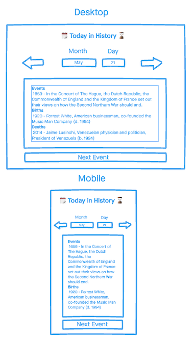
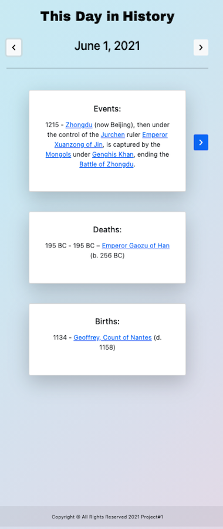
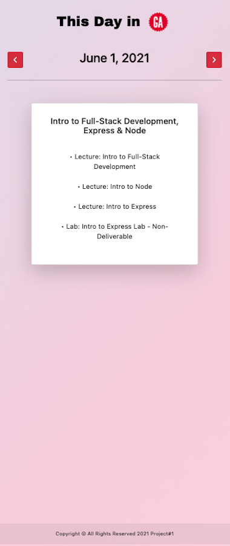

<!-- PROJECT LOGO -->
<br />
<p align="center">
  <a href="https://garrettgarrett.github.io/Project1-On-This-Day/">
    
  </a>

  <h3 align="center">On This Day</h3>

  <p align="center">
    What Happened Today in History?
    <br />
    <a href="https://github.com/GarrettGarrett/Project1-On-This-Day"><strong>Explore the docs »</strong></a>
    <br />
    <br />
  </p>
</p>

<!-- TABLE OF CONTENTS -->
<details open="open">
  <summary>Table of Contents</summary>
  <ol>
    <li>
      <a href="#about-the-project">About The Project</a>
      <ul>
        <li><a href="#built-with">Built With</a></li>
      </ul>
    </li>
    <li>
      <a href="#wireframe">Wireframe</a>
    </li>
    <li><a href="#getting-started-with-the-api">Getting Started with the API</a></li>
    <li><a href="#screenshots">Screenshots</a></li>
     <li><a href="#future-enhancements">Future Enhancements</a></li>
    <li><a href="#contact">Contact</a></li>
  </ol>
</details>

<!-- ABOUT THE PROJECT -->
# About The Project
This is my first developer project with General Assembly! Discover the events, deaths, and births that occured today in history.  Each result includes hypperlinks to their corresponding pages on Wikipedia.  There are 2 modes to this app: 
* This day in History - Displays events, births, and deaths from history.
* This Day in General Assemlby  - Displays the daily overview for the SEI Immersive class 5/10/21- 8/4/21.
The finished product can be viewed [here](https://garrettgarrett.github.io/Project1-On-This-Day/)

# Built With

* [HTML5](https://developer.mozilla.org/en-US/docs/Glossary/HTML5)
* [CSS3](https://developer.mozilla.org/en-US/docs/Web/CSS)
* [JavaScript](https://www.javascript.com/)
* [jQuery](https://jquery.com/)

# Wireframe

Here is my original wireframe drawn with [InVision](https://www.invisionapp.com/).  I made a few adjustments for the final product!




<!-- API -->
# Getting Started with the API
I used the free Muffinabs [API](http://history.muffinlabs.com/#api) for this project.  It uses Wikipedia entries for each day of the year and parses this information into JSON data.

* API Call
  ```
  $.ajax(`http://history.muffinlabs.com/date/2/14`)
    .then(function(data) { 
        apiInfo = data;
        render();
        
        });
  ```
* API Response
  ```
    {
    "date": "February 14",
     "url": "http://wikipedia.org/wiki/February_14",
    "data":{
        "Events":[ // data here // ],
        "Births":[ // data here // ],
        "Deaths":[ // data here // ]
    }
    
  ```

<!-- USAGE EXAMPLES -->
# Screenshots
### This day in History:


### This Day in General Assemlby:



# Future Enhancements
* Add images from Wikipedia for each event.
* Add a drop down calandar for selecting dates.

<!-- CONTACT -->
# Contact
Project Link: [https://github.com/GarrettGarrett/Project1-On-This-Day](https://github.com/GarrettGarrett/Project1-On-This-Day)

